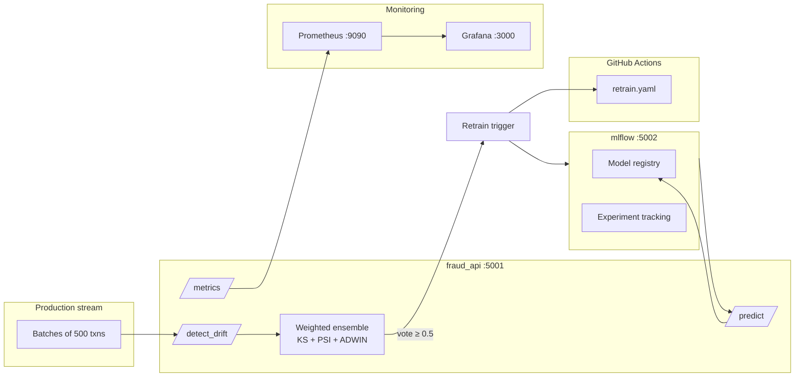

# Fraud Detection MLOps Pipeline

Production-grade **end-to-end MLOps** for real-time credit card fraud detection, with a **weighted ensemble concept drift** layer that governs automated retraining. Built for research and reproducibility: containerised services, MLflow tracking, Prometheus/Grafana monitoring, and GitHub Actions CI/CD.

**Paper:** *A Weighted Ensemble Concept Drift Detection System for Financial Fraud Detection within a Comprehensive MLOps Pipeline* — Mahad Saeed & Muhammad Alizaib, FAST-NUCES Islamabad.

**Paper link:** https://drive.google.com/file/d/1WZvTV_uNeV2lF7x7_CdGTtsDGIkq5jjB/view?usp=sharing

**Demo video:** https://drive.google.com/file/d/1e21ww8Ti38XAZ2mrqpTsBobw41qBSGbf/view?usp=drive_link

---

## Highlights

| Area | Detail |
|------|--------|
| **Fraud model** | XGBoost (production) and Logistic Regression (baseline); severe imbalance handled via `scale_pos_weight` / `class_weight='balanced'` |
| **Model performance** | XGBoost **F1 = 0.796**, AUC-ROC = 0.976 on the [Kaggle Credit Card Fraud](https://www.kaggle.com/datasets/mlg-ulb/creditcardfraud) dataset (~0.17% fraud rate) |
| **Drift detectors** | Kolmogorov–Smirnov (KS), Population Stability Index (PSI), Adaptive Windowing (ADWIN) |
| **Core contribution** | **Weighted ensemble** with dynamic false-positive penalty: \(w_i = 1 - \text{FP\_rate}_i\), normalised vote threshold \(\tau = 0.5\) |
| **Empirical gains** | **97.6%** lower false trigger rate vs KS/ADWIN/unweighted baselines; **95.9%** fewer unnecessary retrains; detection delay **11 batches** (matches best single detector, PSI) |
| **Ops** | 4 Docker Compose services, hot-reload serving from MLflow, 15s Prometheus scrape, Grafana dashboards |

---

## Architecture



**Lifecycle**

1. **Train** — `src/train.py` fits models on 70% of data, logs metrics and artifacts to MLflow, registers `fraud_detector`.
2. **Serve** — `src/serve.py` loads the latest registry version, exposes prediction and drift APIs, exports Prometheus metrics.
3. **Monitor** — Each batch calls `/detect_drift`; ensemble scores and weights are logged to MLflow and scraped by Prometheus.
4. **Retrain** — On drift vote ≥ threshold: local `src/retrain.py` (Docker exec) plus optional `repository_dispatch` to GitHub Actions for full CI/CD promotion.

---

## Weighted ensemble (research contribution)

Unlike unweighted majority voting (where noisy KS + ADWIN dominate), each detector \(i\) receives weight inversely proportional to its historical false-positive rate:

\[
w_i = 1 - \text{FP\_rate}_i, \quad \hat{w}_i = \frac{w_i}{\sum_j w_j}, \quad \text{retrain if } \sum_i \hat{w}_i \cdot d_i \geq 0.5
\]

Pre-drift false alarms down-weight unreliable detectors; the system **converges toward PSI** (~0.98 weight by batch 80 in experiments) without manual detector selection.

Implementation: [`src/detectors/ensemble.py`](src/detectors/ensemble.py).

---

## Experimental results (abrupt covariate drift)

Simulated on the production stream (30% holdout): drift injected at batch 85/171 by scaling `scaled_amount` and V1–V9 by **2.5×** plus Gaussian noise. Reproduce with [`run_experiments.py`](run_experiments.py).

| Configuration | False trigger rate | Detection delay | Total retrains |
|---------------|-------------------:|----------------:|---------------:|
| KS-test alone | 1.000 | 0 | 171 |
| PSI alone | 0.000 | 11 | 3 |
| ADWIN alone | 1.000 | 0 | 171 |
| Unweighted majority | 1.000 | 0 | 171 |
| **Weighted ensemble (ours)** | **0.024** | **11** | **7** |

Artifacts: [`results/summary_table.csv`](results/summary_table.csv), [`results/experiment_results.csv`](results/experiment_results.csv), [`results/drift_scores_plot.png`](results/drift_scores_plot.png).

---

## Project structure

```
fraud-mlops/
├── src/
│   ├── train.py              # Initial training (LR + XGBoost → MLflow)
│   ├── retrain.py            # Drift-triggered XGBoost retrain
│   ├── serve.py              # Flask API: predict, detect_drift, metrics
│   └── detectors/
│       ├── ensemble.py       # Weighted ensemble (proposed)
│       ├── ks_detector.py
│       ├── psi_detector.py
│       └── adwin_detector.py
├── docker/
│   ├── docker-compose.yml    # mlflow, fraud_api, prometheus, grafana
│   ├── Dockerfile
│   └── Dockerfile.mlflow
├── monitoring/
│   ├── prometheus.yml
│   ├── alert.rules.yml
│   └── grafana/dashboard.json
├── .github/workflows/
│   └── retrain.yaml          # CI/CD: train, evaluate, promote, build image
├── notebooks/
│   └── 01_eda.ipynb
├── run_experiments.py        # Paper experiment reproduction
├── requirements.txt
└── results/                  # Experiment outputs
```

---

## Prerequisites

- **Python 3.12** (local dev) / **3.10** (API Docker image)
- **Docker Desktop** (Compose stack)
- **Dataset:** download [`creditcard.csv`](https://www.kaggle.com/datasets/mlg-ulb/creditcardfraud) into `data/creditcard.csv` (gitignored)

Optional for remote retrain dispatch:

- GitHub personal access token with `repo` scope → `GITHUB_TOKEN` (never commit tokens; use `.env` or Compose `environment`)

---

## Quick start

### 1. Install dependencies

```bash
pip install -r requirements.txt
```

### 2. Train and register models

```bash
python src/train.py
```

Logs two runs to MLflow (`fraud-detection-baseline`): Logistic Regression v1 and XGBoost v2, both registered as `fraud_detector`.

### 3. Start the full stack

```bash
cd docker
docker compose up --build
```

| Service | URL |
|---------|-----|
| Fraud API | http://localhost:5001 |
| MLflow UI | http://localhost:5002 |
| Prometheus | http://localhost:9090 |
| Grafana | http://localhost:3000 (default `admin` / `admin`) |

Import the bundled dashboard from [`monitoring/grafana/dashboard.json`](monitoring/grafana/dashboard.json) and point Prometheus to `http://prometheus:9090`.

### 4. Smoke-test the API

```bash
# Health
curl http://localhost:5001/health

# Prediction (feature dict must match training columns)
python send_legit.py
python send_fraud.py

# Ensemble summary
curl http://localhost:5001/summary
```

### 5. Reproduce drift experiments

With the API running:

```bash
python run_experiments.py
```

---

## API reference

### `POST /predict`

```json
{
  "features": {
    "V1": -1.35, "V2": 0.91, "...": 0.0,
    "scaled_amount": -0.42, "scaled_time": -1.10
  }
}
```

Response includes `prediction` (0/1), `label`, `model_version`, `latency_ms`.

### `POST /detect_drift`

```json
{
  "batch_id": 42,
  "batch": [ { "V1": 0.1, "scaled_amount": -0.5, "...": 0.0 }, ... ]
}
```

Returns per-detector scores, votes, **weights**, `weighted_vote`, and `retraining_triggered`.

### `GET /metrics`

Prometheus exposition format (scraped every 15s).

### `GET /health` · `GET /summary`

Service status and cumulative ensemble statistics.

---

## CI/CD (GitHub Actions)

Workflow: [`.github/workflows/retrain.yaml`](.github/workflows/retrain.yaml)

**Triggers**

- `repository_dispatch` event `drift-detected` (from API when ensemble fires)
- Manual `workflow_dispatch`
- Push to `src/train.py` or `src/detectors/**`

**Pipeline steps:** install deps → train → compare F1 in MLflow → promote best version to Production → build/push Docker image to GHCR (if promoted).

Configure repository secrets: `GHCR_TOKEN` for image push.

---

## Tech stack

| Layer | Tools |
|-------|--------|
| ML | Python, scikit-learn, XGBoost |
| Tracking | MLflow (experiments + model registry) |
| Serving | Flask, `prometheus-client` |
| Drift | SciPy (KS), custom PSI/ADWIN |
| Infra | Docker Compose |
| Monitoring | Prometheus, Grafana |
| Automation | GitHub Actions |

---

## Dataset & preprocessing

- **Source:** ULB MLG credit card fraud dataset (284,807 transactions, 30 features).
- **Preprocessing:** z-score `Amount` and `Time` → `scaled_amount`, `scaled_time`; drop raw columns.
- **Split:** 70% reference (train + detector calibration), 30% sequential production stream for drift simulation.
- **Imbalance:** fraud rate ≈ 0.17%; XGBoost uses `scale_pos_weight`, logistic regression uses `class_weight='balanced'`.

---

## Authors

- **Mahad Saeed** — Department of Data Science, FAST-NUCES, Islamabad
- **Muhammad Alizaib** — Department of Data Science, FAST-NUCES, Islamabad

---

## Citation

If you use this repository in academic work, please cite the associated paper (*A Weighted Ensemble Concept Drift Detection System for Financial Fraud Detection within a Comprehensive MLOps Pipeline*).

---

## License

No license file is included yet. Add one before public distribution if required by your institution or employer.
